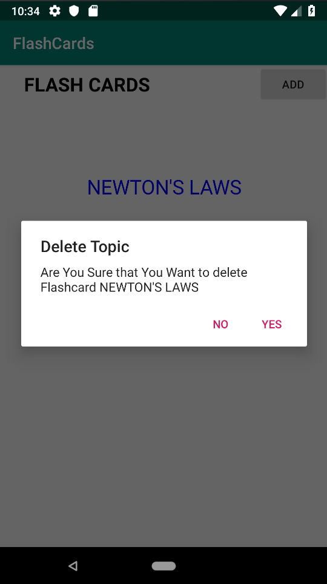
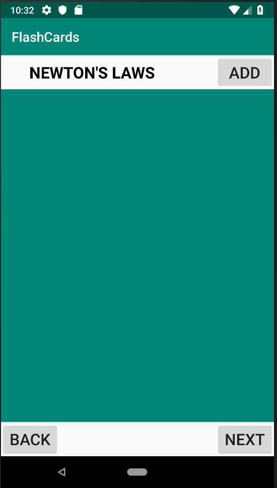
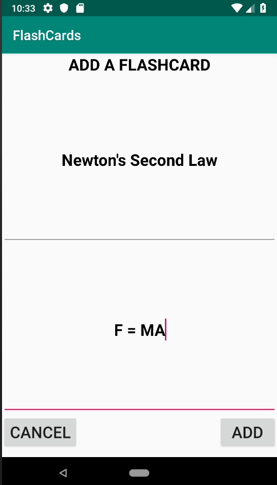
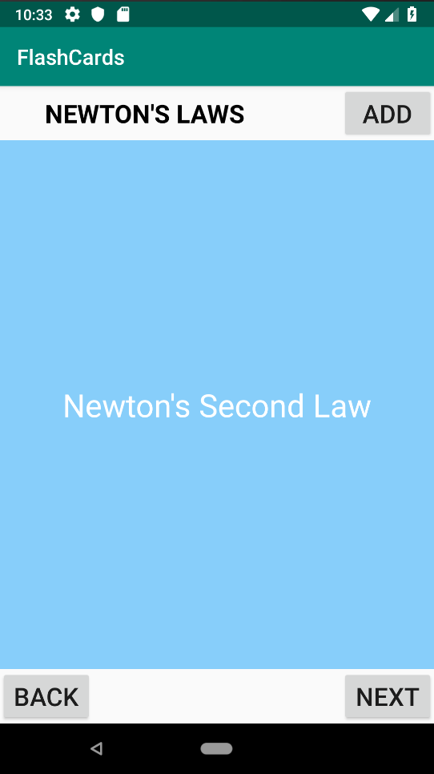
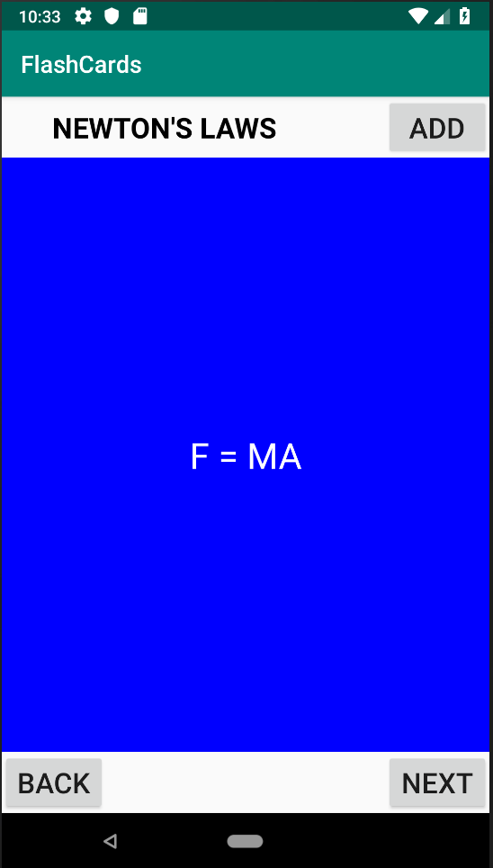

# FlashCards
A FlashCard Android App.  
It is A learning app that shows questions and answers for different Topics (which can be created). 
The App is robust against interferences such as device rotation. 
## Images to Show the Flow of the App in Action
<h3>1</h3>

 This is The Welcome Screen of the App   on Clicking Add we go to 2

<h3>2</h3>

 We can add topics here by clicking add, moving onto 3. Cancel Just returns to the welcome page

<h3>3</h3>

 Added topic is shown here. On long press of the topic we move onto 4. A short press moves onto 5.

<h3>4</h3>

Here We get a Dialog Box asking if we want to remove the topic. Yes Deletes it and all the contents stored in it.

<h3>5</h3>

Here we Can View All our FlashCards. At the moment there arn't any. We can Add by clicking add (6). Back moves back to welcome Screen Next moves onto the next FlashCard if Present

<h3>6</h3>

Here We can add the front and back sides to the FlashCard. Add adds the FlashCard and Cancel takes u back to the topics that have all the flashCard On adding we move to 7

<h3>7</h3>

We Can Press the Contents to View the BackSide (8)

<h3>8</h3>

