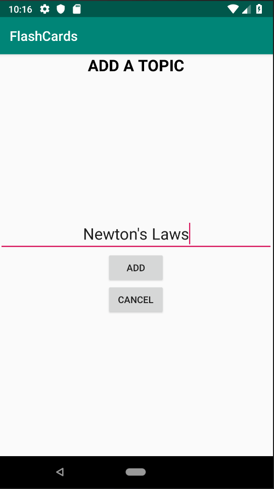
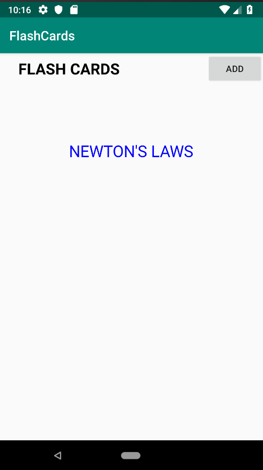

# FlashCards
A FlashCard Android App.  
It is A learning app that shows questions and answers for different Topics (which can be created). 
The App is robust against interferences such as device rotation. 
## Images to Show the Flow of the App in Action
<h3>1</h3>

 This is The Welcome Screen of the App   on Clicking Add we go to 2

<h3>2</h3>

 We can add topics here by clicking add, moving onto 3. Cancel Just returns to the welcome page

<h3>3</h3>

 Added topic is shown here. On long press of the topic we move onto 4. A short press moves onto 5.

